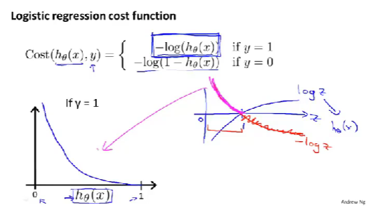
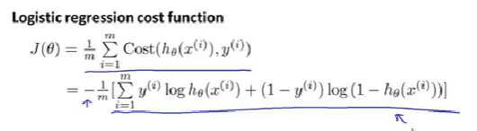

# 第三周

## 六、逻辑回归

### 6.1 分类问题

* 二元分类问题：将因变量(dependent variable)可能属于的两个类分别称为负向类（negative class）和正向类（positive class），则因变量$y∈0,1$，其中 0 表示负向类，1 表示正向类。
* 逻辑回归算法的性质是：它的输出值永远在 0 到 1 之间。
* 逻辑回归算法实际上是一种分类算法，它适用于标签  取值离散的情况，如：1 0 0 1。

### 6.2 假设表示

* 逻辑回归模型的假设是：$h_\theta \left( x \right)=g\left(\theta^{T}X \right)$，$X$ 代表特征向量，$g$ 代表逻辑函数（**logistic function**)/**S**形函数（**Sigmoid function**），公式为： $g\left( z \right)=\frac{1}{1+{{e}^{-z}}}$。
* **python**代码实现：

  ```python
  import numpy as np

  def sigmoid(z):

  return 1 / (1 + np.exp(-z))
  ```
* 该函数的图像为：
  
* 将$\theta^{T}X$代入$z$即可得到逻辑回归模型的假设：$h_\theta \left( x \right)=\frac{1}{1+{{e}^{-\theta^{T}X}}}$。
* 假设解释：$h_\theta \left( x \right)$ 的作用是，对于给定的输入变量$x$ ，根据选择的参数 $\theta $ 计算输出变量 $y=1$ 的可能性（**estimated probablity**），即 $h_\theta \left( x \right)=P\left( y=1|x;\theta \right)$ 。例如，如果对于给定的$x$，通过已经确定的参数计算得出$h_\theta \left( x \right)=0.7$，则表示有70%的几率$y$为正向类，相应地$y$为负向类的几率为1-0.7=0.3。

### 6.3 决策边界

* 
* 在逻辑回归中，我们预测：
  * 当${h_\theta}\left( x \right)>=0.5$时，预测 $y=1$。
  * 当${h_\theta}\left( x \right)<0.5$时，预测 $y=0$ 。
    根据上面绘制出的 **S** 形函数图像，我们知道当：
  * $z=0$ 时 $g(z)=0.5$
  * $z>0$ 时 $g(z)>0.5$
  * $z<0$ 时 $g(z)<0.5$又$z={\theta^{T}}x$ ，即：
  * ${\theta^{T}}x>=0$ 时，预测 $y=1$
  * ${\theta^{T}}x<0$ 时，预测 $y=0$
* 假设我们有一个训练集以及假设函数为：
  其中，假设已拟合得到参数$\theta$ 是向量[-3 1 1]。 则当$-3+{x_1}+{x_2} \geq 0$，即${x_1}+{x_2} \geq 3$时，模型将预测 $y=1$，反之预测$y=0$（的概率）。我们可以绘制直线${x_1}+{x_2} = 3$，**这条线便是我们模型的分界线（决策边界）**，将预测为 1 的区域和预测为 0 的区域分隔开。
  
  假使我们的数据呈现下面这样的分布情况，怎样的模型才能适合呢？
  
  因为需要用曲线才能分隔 $y=0$ 的区域和 $y=1$ 的区域，我们需要二次方特征（**添加额外的高阶多项式项**）：${h_\theta}\left( x \right)=g\left( {\theta_0}+{\theta_1}{x_1}+{\theta_{2}}{x_{2}}+{\theta_{3}}x_{1}^{2}+{\theta_{4}}x_{2}^{2} \right)$，假设参数向量为[-1 0 0 1 1]，则我们得到的判定边界恰好是圆点在原点且半径为1的圆形。
* **我们可以用非常复杂的模型（利用高阶多项式特征）来适应非常复杂形状的判定边界**。
* **决策边界不是训练集的属性，而是假设本身及其参数$\theta$的属性**，只要给定了参数，决策变量就确定了。（训练集拟合->得到参数$\theta$->确定决策变量）

### 6.4 代价函数

* ~~（改变下记笔记策略）~~
* 简化代价函数->1/m乘以Cost项的求和
  
* 代价函数（或者说是Cost项）理解：在输出的预测值是${h_\theta}\left( x \right)$，而实际标签是$y$的情况下，我们希望**机器学习算法所付出的代价**。
* 1/2平方差不适用于逻辑函数，因为逻辑回归假设函数的**非线性**属性，会使代价函数变为**非凸函数**（图左），难以找到全局最小值。需要找到其他代价函数以构造凸（单弓形）函数（图右），以方便使用算法如梯度下降法，找到全局最小值（拟合）。
  
* 逻辑回归一般使用**对数函数**作为代价函数：
  
  * $y=1$时：
    * 图形（横轴为${h_\theta}\left( x \right)$）：假设函数的输出值在0，1之间，因此$h(x)$的取值也为[0,1]。函数形状类比$-logz$，即对数函数（图右）。
      
    * 性质：
      * $y=1,{h_\theta}\left( x \right)=1,Cost=0$：预测值等于实际值，代价值为0，正确预测。
      * $y=1，{h_\theta}\left( x \right)→0,Cost→∞$：预测值偏离实际值，代价值趋向无穷，错误预测代价极大。
        
  * $y=0$时：
    * 图形：类比$-log(1-z)$（图右）。
      
    * 性质：与$y=1$时相反
      * $y=0,{h_\theta}\left( x \right)→1,Cost→∞$：错误预测，代价极大。
      * $y=0,{h_\theta}\left( x \right)=0,Cost=0$：正确预测，代价为0。

### 6.5 简化代价函数与梯度下降

#### 6.5.1 简化代价函数

* 对于**分类问题（二元分类）**，在训练集甚至非训练集样本中，y的值总是等于 0 or 1 的（由y的数学定义决定的）。
* 鉴于以上性质，合并两种情况（0 or 1）以简化函数，简化原理如下：

  
* 最终简化（原理为统计学知识：极大似然法）：
#### 6.5.2 梯度下降
* **更新参数的规则与线性回归的相似**，但因为假设函数${h_\theta}\left( x \right)$的不同，所以**实际上完全不同**。
  
* 可以用同样的办法监控梯度下降法以保证其拟合（需要复习前面的内容）。
* 更新$\theta$向量可以使用for循环或向量化。
* 同样可以使用特征缩放加快拟合。
### 6.6 高级优化
* 高级优化算法简单来说就是比梯度下降更高级、更复杂的算法，例如**共轭梯度法 BFGS (变尺度法) 和L-BFGS (限制变尺度法)**：
   
   * 这些算法的内部逻辑/具体细节不需要知道，使用即可（调库/调参），使用前需要算出$J\left( \theta \right)$和偏导数项$\frac{\partial }{\partial {\theta_j}}J\left( \theta \right)$。
   * 高级优化算法的特性/优点：
     * 不需要手动选择学习率$\alpha$（存在智能内循环-线搜索算法）
     * 收敛快于梯度下降
   * 缺点：
     * 更复杂
* 原视频举例的语言为Octave（[可参考](https://github.com/fengdu78/Coursera-ML-AndrewNg-Notes)），后续再收集/实现下Python的写法。
### 6.7 多元分类：一对多
* 多类别分类问题举例：邮件分类、疾病诊断、天气预测：
  
* 利用一对多/一对余的分类思想将逻辑回归应用到多类别分类问题上（以三种类别为例）。
  
  * 原理：转化为三个独立的二元分类问题。
    * 类别1：$i=1$（图右上）：
      * 创建新的“伪”训练集：类别2、3设定为负类/负样本（圆形，值0），类别1设为正类/正样本（三角形，值1）；
      * 拟合分类器（假设函数）：$h_\theta^{\left( 1 \right)}\left( x \right)$，其中上标(1)表示类别1；
      * 训练上述模型（拟合->得到参数$\theta$）即可得到相应的判定边界/决策边界。
    * 类别2、3（$i=2,3$）同理（图右中、下）。
    * 总而言之，拟合出三个分类器，对于$i=1,2,3$，拟合分类器$h_\theta^{\left( i \right)}\left( x \right)$，来尝试估计出给定参数$\theta$和输入值$x$时，$y=i$的概率，**即：$h_\theta^{\left( i \right)}\left( x \right)=p\left( y=i|x;\theta  \right)$**。
    
* 当给出新的输入值$x$时，期望获得预测：
  1. 在$n(1≤i≤n)$个分类器运行输入值$x$；
  2. 选择$h$（概率）最大的类别$i$，即**选择出可信度最高、效果最好的分类器**；
  3. 这个$i$就是我们所求的预测值$y(y=i,i=1,2...,n)$。
  
## 七、正则化
### 7.1 过拟合问题
* 线性回归模型中，‘次’对应的是参数阶，‘元’对应的是特征数（个人理解）
* 例子1：线性回归-预测房价
   
  1. 一次函数-直线（图左）：该算法没有很好的拟合训练数据。（**欠拟合 underfitting/高偏差 high bias**）
     * 具体地讲：如果拟合一条直线，好像算法存在很强的偏见或者说非常大的偏差，认为房子价格（特征）与面积（预测值）线性相关，而罔顾数据和证据的不符，先入为主地拟合一条直线，最终导致拟合数据效果很差。
  2. 二次函数-曲线（图中）：拟合效果很好。（**非术语：刚好合适just right**）
  3. 四次函数-扭曲的曲线（图右）：**似乎**，很好地拟合了训练集，通过了所有的数据点；**实际**，不是一个好模型。（**过度拟合 overfitting/高方差 high variance**）
     * 具体地讲：如果我们拟合一个高阶多项式，那么这个假设函数能拟合几乎所有的数据，这就面临可能的函数太过庞大、变量太多的问题，没有足够的数据进行约束，以获得一个好的假设函数。
  4. **总的来说**：过度拟合问题会在变量过多时出现，这时训练出的假设/模型能很好地拟合训练集，即代价函数实际非常接近0或等于0，但是可能得到图右曲线，它千方百计拟合训练集，导致无法**泛化**到新的样本中，无法预测新样本的价格（值）。
     * “泛化”（genernalized）：一个假设模型应用到新样本的能力
     * 新样本数据：没有出现在训练集的房子（数据）
* 例子2：逻辑回归-癌症（与线性回归同理）
  
* 通过绘制图形来选择多项式阶次可以作为一种方法，但不是总是有用的，事实上更多时候学习问题需要很多变量，并且这不仅是选择多项式阶次的问题，此时绘图会变得更难，通过数据可视化来决定保留哪些特征变量也更难。
  * 具体地说：如果我们试图预测某个值，有许多特征变量都可能有关，但变量过多，训练集过少，就会出现过度拟合的问题。
* 两个办法解决过拟合问题：
  1. 减少选取变量的数量
     * 手动选择要保留的变量
     * 模型选择算法（自动选择变量）
     * 缺点：损失了部分特征变量
  2. 正则化(Regulariztion)
     * 保留所有特征，但是减少参数$\theta$的大小或量级
     * 当我们有很多特征时效果很好，每个特征都有助于预测$y$
### 7.2 代价函数
* 举个例子（同7.1例子1-过拟合）
  * 尝试在代价函数中**加入惩罚项**，使得参数$\theta_3$和$\theta_4$都非常小
    * 修改后的代价函数（优化目标是最小化代价函数）：$\underset{\theta }{\mathop{\min }},\frac{1}{2m}[\sum\limits_{i=1}^{m}{{{\left( {{h}_{\theta }}\left( {{x}^{(i)}} \right)-{{y}^{(i)}} \right)}^{2}}+1000\theta _{3}^{2}+10000\theta _{4}^{2}]}$，其中1000是任意较大的数字。
    * 为最小化函数，$\theta_3$和$\theta_4$则要尽可能小，即二者接近0，类似直接去掉了这两项。
    * 函数相当于二次函数，最后拟合的函数实际上是二次函数加上非常小的项
  * 综上，在这个例子中，加入惩罚（增大参数）到代价函数中，最终使假设函数类似于二次函数，以此得到了更好的假设函数并保留了特征，这就是正则化背后的思想
  
* 正则化思想：
  * 参数值较小意味着↓
    * 更简单的假设模型↓
    * 更不容易出现过拟合
* 回到房屋预测的例子
  * 把特征数量假设到100个($x_1,x_2,...,x_{100}$)，对应有101个参数（$\theta_0,\theta_1,\theta_2,...,\theta_{100}$），此时，**由于不知道哪些特征相关度较低或为高阶项，所以也不知道应选出哪些对应的参数进行缩小**
  * 因此在正则化中，**我们修改代价函数来缩小所有的参数，即在式子后面加上额外的正则化项（习惯上不包括$\theta_0$）**
   
  
