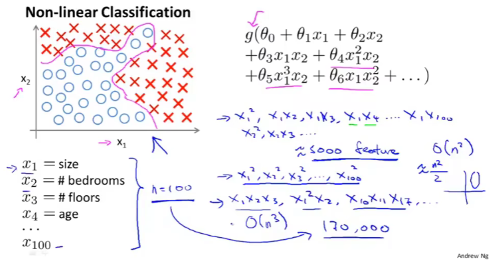
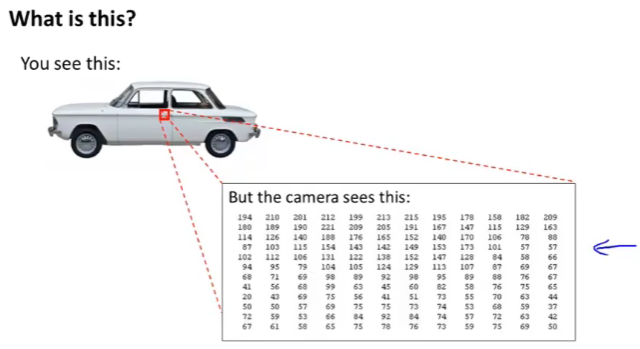
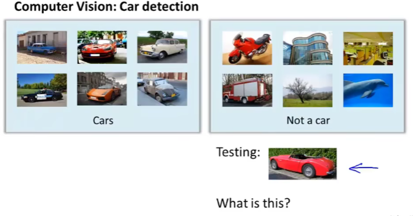
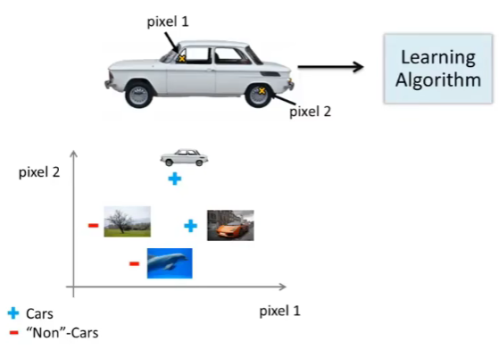
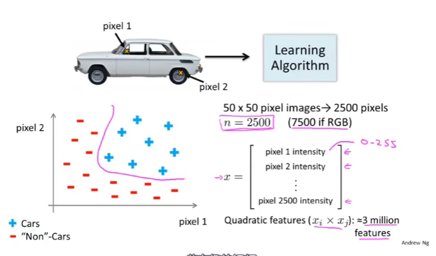

# 第四周  
## 八、神经网络：表述  
### 8.1 非线性假设  
#### 8.1.1 为什么要研究神经网络？  
首先，以几个机器学习问题为例子（两个例子），而这几个问题的解决，都需要学习复杂的**非线性假设**  
#### 8.1.2 例子1：分类问题
假如有一个**监督学习分类问题**，它的训练集如图所示，如果利用逻辑回归算法来解决这个问题，需要构造一个包含很多非线性项的逻辑回归函数（<u>图右上</u>）
* 函数中g仍是s型（sigmoid）函数，即$f(x)=1/(1+e^{-x})$
* 其中，**包含很多多项式**，当多项式项数足够多时，那么可能就能得到可以分开正负样本的假设函数
* 当只有少量特征时（如$x_1,x_2$），逻辑回归确实能得到不错的结果，因为特征的所有组合都包含到多项式中，但是**许多有趣的机器学习问题的特征往往很多**（不止两项）
  * 假设有一个关于住房的分类问题，房子有很多特征，预测房子在未来半年内能被卖出去的概率，**假设对于不同的房子可能有上百个特征**（n>=100）（<u>图左下</u>）
    1. 对于此类问题，如果要包含所有的二次项，即使只包含二次多项式，**最终也会有很多项**（n=100时，也大概会有5000个特征；个数大约为$n^2/2$，O(n²)增长量级）
    2. 由于**项数过多**，最后结果大概率是**过拟合的**；此外，在处理这么多项时，也存在**运算量过大**的问题
    3. **只考虑子集**的话，这样可以大幅度减少项数，但是由于**忽略太多相关项**，在处理类似图左上的数据时，不可能得到理想的结果，不能拟合出一些特别的假设，即**欠拟合**
  * 总的来说，**如果，当初始特征个数n很大时，将高阶多项式项数包括到特征里，会使特征空间急剧膨胀；此时，增加特征来建立非线性分类器并不是一个好做法（存在很多缺点）；同时，对于许多实际的机器学习问题，特征个数n往往是很大的**
* 
#### 8.1.3 例子2：图像识别
另一个例子，关于计算机视觉中的一个问题：使用机器学习算法来训练一个分类器，来检测图像，判断图像是否为一辆车。
* 首先，以图像中红色方框区域（汽车门把手）为例：与人体看到的不同，**计算机实际上看到的图像是一个数据矩阵，或者说表示像素强度值的网格，代表了每个像素的亮度值**
  * 因此，该计算机视觉问题就是：**根据像素点亮度矩阵，来告诉我们这些数值代表什么**（汽车门把手）。
  * 
* 具体而言，当我们用机器学习算法构造一个汽车识别器时:
  1. 提供一个带标签的样本集，其中一部分样本是各类汽车，另一部分样本不是车
  2. 将这个样本集输入给学习算法，以训练出一个分类器
  3. 然后进行测试，输入一幅新的图片（<u>图右下</u>），让分类器判定这是什么东西，理想情况下，分类器能识别出这是一辆车  
    
* 为了理解引入**非线性假设的必要性**，我们从学习算法的训练样本中找出一些汽车图片和一些非汽车图片：
  1. 选取刚才用过的那张图片：我们从中选择一组像素点位（<u>图中上，像素点1、像素点2</u>），在坐标系中标出这幅汽车的位置，车的位置取决于像素点1、2的强度
  2. 用同样方法处理其他图片，再看另一个汽车图片的例子：同样取两个相同的像素位置（*这里的位置指的是在图片上取像素点的位置*），这幅新汽车图片中像素1有一个像素强度，像素2也有一个不同的像素强度，所以在这幅图在坐标系上处于另一个位置
  3. 继续画上两个非汽车样本：用+表示汽车图片，用-表示非汽车图片
    
  4. 继续在坐标系上画上更多的新样本：我们将发现汽车样本和非汽车样本分布在坐标系中的不同区域，因此我们现在**需要一个非线性假设来尽量分开这两类样本**（<u>图左下</u>）
  5. 特征空间的维数是多少？
     1. 假设我们用50*50像素的图片（**已经很小了，长宽只是各有50个像素**），即有2500个像素点，因此，**特征向量x的元素数量为n=2500**（特征向量x即是包含了所有像素强度的列表，包括像素点1、像素点2、...、像素点2500）
     2. 对于典型的计算机图片表示方法，如果存储的是每个像素点的灰度值，那么每个元素的值应该在0到255之间，这个问题中n=2500只是使用灰度图片的情况;如果用的是**RGB彩色图像**，每个像素点包含<红 绿 蓝>三个值，那么此时**特征向量的数量将达到7500（n=7500）**
     3. 因此，如果我们要通过**包含所有的二次项特征来学习得到非线性假设**，总共就**约有300万个特征**（2500个像素），**数值过于庞大**；对于每个样本都要找到并表示所有的这300万个特征，**计算成本过高**
  6. 因此，只是包括平方项或立方项特征简单的**逻辑回归算法，并不是一个在n很大时（特征过多），学习复杂的非线性假设的好办法**  
    
* 而神经网络则可以很好地处理n或特征空间很大的问题
### 8.2 神经元和大脑  
