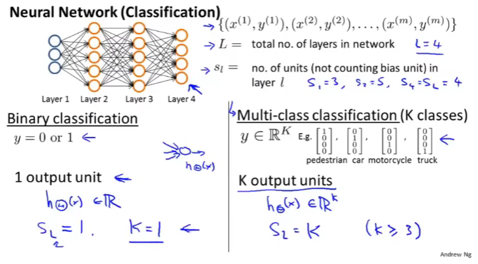
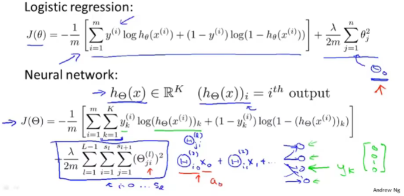

# 第五周  
## 九、神经网络：学习  
### 9.1 代价函数  
* 重点讲解神经网络在**分类问题**中的应用  
  * 条件假设：  
    * 有神经网络结构（图左上）  
    * 有训练集 $ (x^{(i)},y^{(i)})(1<=i<=m)$ ，即该训练集有m组训练样本  
    * 用大写L表示神经网络结构的总层数（图中神经网络结构，L = 4）  
    * 用 $ s_l $表示第l层的单元数，即神经元的数量，其中不包括偏差单元（图中结构， $ s_1 = 3, s_2 = 5, s_4=s_L = 4 $ ）  
  * 考虑两种分类问题：  
    * 二元分类：y只能为0或1；只有一个输出单元，即 $ h_{\Theta}(x) $（ $ h_{\Theta}(x)∈R $ ，为实数）； $ s_L = 1 $ ；为简化写法，K = 1  
    * 多类别分类：K个不同的类；K个输出单元，假设输出K维向量，即 $ h_{\Theta}(x)∈R^K $ ； $ s_L=K(K≥3) $ ；K小于3时，不需要多类别分类问题，二元分类即可  
  *   
* 为神经网络定义代价函数
  * 在神经网络里使用的代价函数基于逻辑回归中使用的代价函数的一般形式（图上）：$$  J(\theta) = -\frac{1}{m} \left[ \sum_{i=1}^{m} y^{(i)} \log h_\theta(x^{(i)}) + (1 - y^{(i)}) \log (1 - h_\theta(x^{(i)})) \right] + \frac{\lambda}{2m} \sum_{j=1}^{n} \theta_j^2 $$ 
  * 不同的地方在于：不仅有一个逻辑回归输出单元 $ y^{(i)} $ ，而是K个，即得出神经网络的代价函数：(图下)
  $$h_\theta\left(x\right)\in \mathbb{R}^{K}$$  $${\left({h_\theta}\left(x\right)\right)}_{i}={i}^{th} \text{output}$$  $$J(\Theta) = -\frac{1}{m} \left[ \sum\limits_{i=1}^{m} \sum\limits_{k=1}^{k} {y_k}^{(i)} \log \substack{(h_\Theta(x^{(i)}))} + \left( 1 - y_k^{(i)} \right) \log \left( 1- \substack{\left( h_\Theta \left( x^{(i)} \right) \right)} \right) \right] + \frac{\lambda}{2m} \sum\limits_{l=1}^{L-1} \sum\limits_{i=1}^{s_l} \sum\limits_{j=1}^{s_{l+1}} \left( \Theta_{ji}^{(l)} \right)^2$$
    * 参数定义：
      1. 神经网络输出属于 $ R^K $ 的向量（二元分类问题时，K = 1）
      2. 用 $ (h_{\Theta}(x))_i $ 表示第 $ i $ 个输出（图中），即 $ h_{\Theta}(x) $ 是一个K维向量
      3. 下标 $ i $ 表示选择输出神经网络输出向量中的第 $ i $ 个元素
    * 公式解释：
      1. 看起来，-1/m乘以一个类似于逻辑回归中所用的求和项
      2. 不同在于，公式中求k的从1到K的所有和
      3. **该求和项是K个输出单元之和**，假设有四个输出单元，则该求和项可解释为：**求k等于1到4的每一个逻辑回归算法的代价函数，然后按四次输出的顺序依次相加**
      4. 可以注意到，该求和符号应用于$y_k$和$h_k$，因为主要是将第K个输出单元的值（即$h_k$）和$y_k$的值的大小作比较
      5. 公式中的最后一项，类似于逻辑回归中所用的正则化项，简单来说就是对${{\Theta_{ji}}}^l$项，对所有的$i,j, l$值求和；像逻辑回归一样，不包括偏差值项$\theta_0$，具体地说就是不对那些${{\Theta_{ji}}}^l$中i为的项进行求和（即不包括偏差单元的项）；不将偏差项正则化是约定俗成的，加或不加效果相当
  *  
### 9.2 反向传播算法